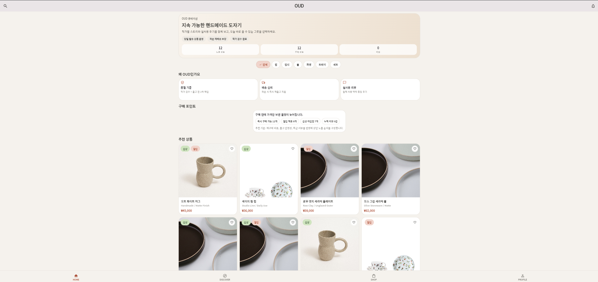
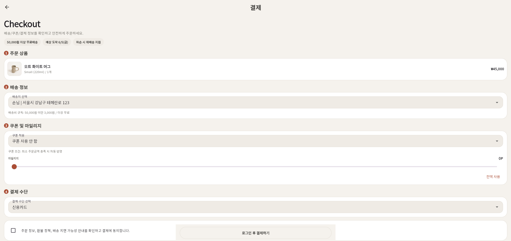
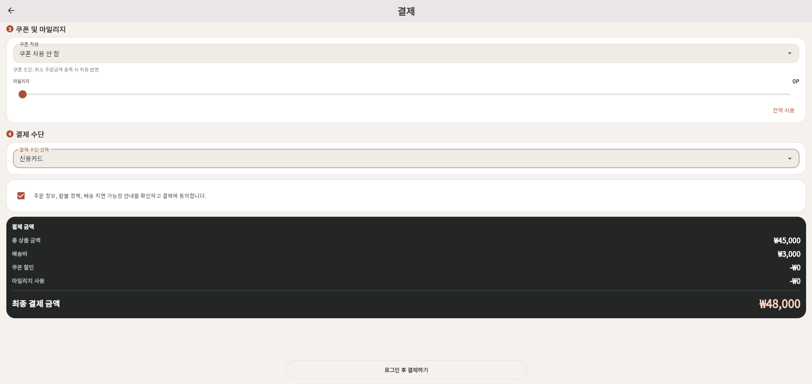

# OUD - Role-Based Ceramic Commerce App

구매자, 판매자, 관리자 역할을 기반으로 상품 탐색, 주문, 리뷰, 마일리지, 운영 관리를 구현한 Flutter/Firebase 커머스 앱입니다.

- Demo: https://mink20001203-hub.github.io/ceramic_app/
- GitHub: https://github.com/mink20001203-hub/ceramic_app

## 빠른 문서 링크

| 문서 | 내용 |
| --- | --- |
| [PROJECT_OVERVIEW.md](docs/PROJECT_OVERVIEW.md) | 프로젝트 목적, 핵심 사용자, 현재 상태, 개선 계획 |
| [FEATURES.md](docs/FEATURES.md) | 구매자, 판매자, 관리자 역할별 기능 |
| [FIRESTORE_SCHEMA.md](docs/FIRESTORE_SCHEMA.md) | Firestore 컬렉션 구조와 접근 권한 |
| [AI_WORKFLOW.md](docs/AI_WORKFLOW.md) | Codex/Gemini 활용 방식과 검증 원칙 |
| [TROUBLESHOOTING.md](docs/TROUBLESHOOTING.md) | 문제 해결 사례와 남은 리스크 |
| [QA_CHECKLIST.md](docs/QA_CHECKLIST.md) | 기능별 수동 QA 체크리스트 |

## 1. 프로젝트 소개

OUD는 도자기 상품 커머스를 가정하고 만든 Flutter 기반 포트폴리오 프로젝트입니다.

단순 상품 목록 앱이 아니라, 구매자, 판매자, 관리자 역할을 나누고 각 역할에 맞는 화면과 권한 흐름을 구현하는 데 초점을 두었습니다. Firebase Authentication과 Cloud Firestore를 사용해 로그인, 상품, 주문, 쿠폰, 마일리지, 알림, 운영 콘텐츠 데이터를 관리합니다.

## 2. 핵심 기능

### 구매자

- 상품 목록, 카테고리, 검색, 상품 상세
- 장바구니, 주문 생성, 주문 완료
- 주문 목록과 주문 상세 확인
- 주문 상태에 따른 취소 요청
- 쿠폰, 마일리지, 리뷰, 프로필 관리
- 주문/정책/쿠폰 관련 알림 확인

### 판매자

- 판매자 전용 상품/주문 관리
- 본인 판매 범위의 주문만 조회
- 배송 상태 변경 및 운송장 입력
- 취소 요청 주문 처리

### 관리자

- 사용자 역할 관리
- 정책/FAQ 운영 콘텐츠 관리
- Firestore rules 기준 관리자 권한 분리

## 3. 기술 스택

| 구분 | 기술 |
| --- | --- |
| App | Flutter, Dart |
| State | Provider |
| Backend | Firebase Authentication, Cloud Firestore |
| Hosting | GitHub Pages |
| Local Data | SharedPreferences, Hive |
| QA/Test | Flutter analyze, Firestore rules test, Node.js audit scripts |

## 4. 프로젝트 구조

```text
lib/
  main.dart
  data/
  models/
  repositories/
  screens/
  theme/
  widgets/
docs/
  PROJECT_OVERVIEW.md
  FEATURES.md
  FIRESTORE_SCHEMA.md
  AI_WORKFLOW.md
  TROUBLESHOOTING.md
  QA_CHECKLIST.md
scripts/
  firestore rules test, seed, audit scripts
```

## 5. 사용자 역할별 흐름

```text
구매자: 홈/검색 -> 상세 -> 장바구니 -> 주문 -> 주문 목록/상세
판매자: 판매자 화면 -> 본인 주문 확인 -> 배송/취소 처리
관리자: 관리자 화면 -> 사용자 역할 관리 -> 운영 콘텐츠 관리
```

## 6. Firestore 데이터 구조

주요 컬렉션은 다음과 같습니다.

```text
users/{uid}
users/{uid}/reviews/{reviewId}
users/{uid}/coupons/{couponId}
users/{uid}/mileageLogs/{logId}
products/{productId}
orders/{orderId}
coupons/{couponId}
policies/{policyId}
supportFaqs/{faqId}
```

권한 구조는 `users/{uid}.role` 값을 기준으로 `user`, `seller`, `admin`을 구분합니다. 자세한 내용은 [FIRESTORE_SCHEMA.md](docs/FIRESTORE_SCHEMA.md)에 정리했습니다.

## 7. AI 활용 방식

AI는 코드 자동 생성 도구가 아니라 요구사항 분해, 구현 보조, 오류 해결, 문서 검토를 위한 보조 도구로 사용했습니다.

- 역할별 요구사항 분해
- 주문 상태 흐름과 QA 체크리스트 초안 정리
- Firestore rules 테스트와 감사 스크립트 방향 검토
- Flutter UI 오류, 권한 오류, 인코딩 문제 해결 과정 정리
- README와 docs 구조 검토

AI 제안은 그대로 사용하지 않고 실제 코드 확인, 정적 분석, rules 테스트, 수동 QA 기준으로 검증했습니다.

## 8. 문제 해결 경험

- 화면에서만 role을 구분하지 않고 Firestore rules까지 함께 설계했습니다.
- 판매자 주문이 다른 판매자에게 노출되지 않도록 sellerId 기준 필터링과 감사 스크립트를 사용했습니다.
- Flutter UI overflow, 텍스트 잘림, 한글 인코딩 문제를 QA 항목으로 분리했습니다.
- Windows 환경의 Flutter analyze 권한 문제를 트러블슈팅 문서로 정리했습니다.

## 9. 실행 방법

```powershell
flutter pub get
flutter run -d chrome
```

웹 빌드:

```powershell
flutter build web --release --base-href /ceramic_app/
```

Firestore rules 테스트:

```powershell
cd scripts
npm install
npm run test:rules
```

## 10. 보안 주의사항

- Firebase Admin SDK 서비스 계정 키, `.env`, 개인 비밀번호는 커밋하지 않습니다.
- 로컬 Admin SDK 스크립트는 `GOOGLE_APPLICATION_CREDENTIALS` 환경변수로 서비스 계정 키를 주입합니다.
- 공개 배포 전 Firebase Console에서 API key 제한과 Firestore rules 배포 상태를 확인합니다.
- `keys/` 폴더와 로컬 캡처/빌드 산출물은 `.gitignore`로 제외합니다.

## 11. Screenshots

OUD의 핵심 구매자 흐름은 Home → Detail → Checkout → Payment 순서로 구성했습니다.  
사용자가 상품을 탐색하고, 옵션과 수량을 선택한 뒤, 주문 정보와 최종 결제 금액을 확인하는 흐름을 중심으로 구현했습니다.

| Home | Detail |
| --- | --- |
|  |  |
| 상품 목록과 추천 상품 탐색 | 옵션/수량 선택 및 예상 합계 확인 |

| Checkout | Payment |
| --- | --- |
|  |  |
| 배송지, 쿠폰, 마일리지, 결제수단 입력 | 배송비, 할인, 최종 결제 금액 확인 |

## 12. 한계 및 개선 계획

- 일부 코드/문서의 한글 인코딩 깨짐 정리 필요
- 최신 스크린샷과 QA 결과 보강 필요
- GitHub Pages 배포 산출물과 소스 브랜치 분리 필요
- 실제 결제 PG 연동은 개선 예정
- 리뷰/알림/운영 콘텐츠 기능의 E2E 검증 보강 필요

## 13. 포트폴리오 포인트

- 구매자, 판매자, 관리자 역할을 분리한 커머스 구조
- Firestore rules와 화면 로직을 함께 고려한 권한 설계
- 주문 상태 변경, 취소 요청, 판매자 처리 흐름 구현
- QA 체크리스트, 감사 스크립트, 문제 해결 문서 작성
